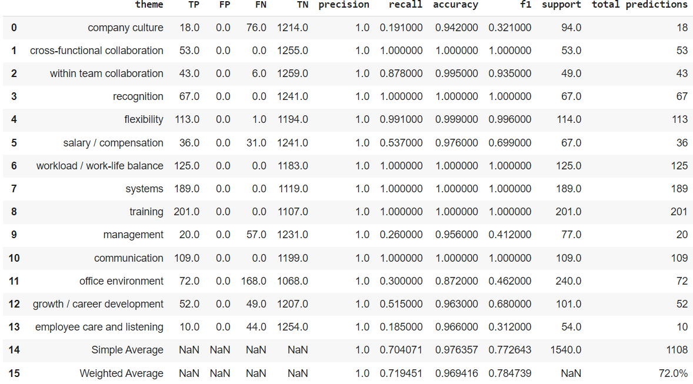

# Multi-Label Multi-Class Text Classification Training Process

## Overview

This repository contains a training pipeline designed to create highly optimized models for multi-label theme classification. The training process leverages **Optuna** for hyperparameter tuning, aimed at achieving the most accurate model per theme. The approach used in this notebook emphasizes computational efficiency while maintaining strong model performance through cross-validation.

**Assumptions and Notes**:
- The dataset is expected to have a column named **'Processed Text'** for consistency between the training and unsupervised analysis notebooks.
- In the labeled training data, **'Themes'** are found in a column where they are separated by commas (', ').
- If you want to evaluate the models further, an additional `test.csv` file should be provided with manually tagged themes for evaluation. The quality of these models is evaluated through cross-validation on the entire dataset.

**Files**:
- 'ModelDevelopment.ipynb' - The main notebook, featuring the training and evaluating process
  
## Optimal Training Using Optuna

This notebook features an enhanced training process using **Optuna** for hyperparameter optimization. Optuna helps to find the most stable and accurate model for each theme. However, this process is computationally expensive and should be used with that in mind.

### Key Steps:
1. **Model Training**: For each theme, an optimization flow is initiated. The model's hyperparameters are tuned for optimal results.
2. **Model Selection**: After each model type is trained, the one with the best threshold that yields the most favorable results through cross-validation is selected.
3. **Threshold Optimization**: The model chosen is the one where the best threshold produces the highest precision with acceptable recall.

### Performance Considerations:
- **Computational Expense**: This process is computationally intensive and should be used when performance gains are critical.
- **Thread Pool Usage**: The use of `ThreadPool` can accelerate the process, but be aware that it may disrupt the log prints in the current version. Feel free to experiment based on your needs.
- **Small Training Sets**: The models used in this training process are relatively simple, as it was built for small training sets.
- **Precision-Recall Tradeoff**: The training process is designed to maximize the **Precision** score for each class. If a model achieves 100% precision, the model is allowed to improve recall. Training is stopped early for simple models if precision ≥ 90% and recall ≥ 50%, but this threshold can be adjusted.

## How to Use

1. Ensure the input data follows the expected format, with a **'Processed Text'** column and a **'Themes'** column containing comma-separated themes.
2. If you'd like to test the model further, upload an additional `test.csv` file with manually tagged themes.
3. Run the notebook to start the training process and allow Optuna to find the best hyperparameters and models for each theme.
4. The final models will be saved and can be used for theme classification tasks, and text analysis across the classified records.

### Flexibility
- The process is adaptable. You can modify the precision and recall thresholds, models used, or the stopping criteria based on the specific requirements of your project.

## Notes
The analysis notebook is not included in this project for intellectual property reasons. You can create your own based on your logic and needs. be sure that such file should include:
- A text preprocess pipeline - as this notebook already assumes your text is preprocessed
- Analysis that match your need, such as Sentiment, NER etc. It is recommended to use the perdicted themes within those analysics.
- It is also recommended to be mindfull and concise with the number of classes provided. Less classes -> more accuracy and granularity.

## Results

Below is a visual representation of the results for each theme and the corresponding models, including key metrics such as **precision**, **recall**, and **optimal threshold**.

